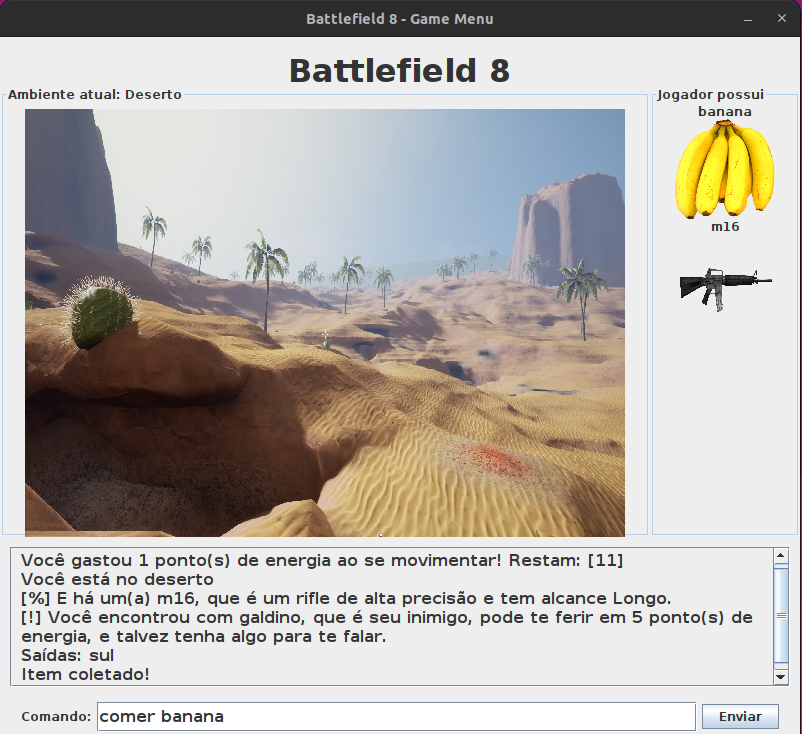

## Projeto Prático Java - Battlefield 8

### Sobre o Jogo:

> O jogador se encontra em um acampamento militar no meio de uma guerra. Entre tantos ambientes, ele tem que resistir à fome e aos inimigos no campo de batalha, com o objetivo de chegar são e salvo na sua família, que está na cidade. O problema é que ele perdeu a chave do carro e não sabe onde está. Para essa missão, ele conta com alguns alimentos espalhados pelos ambientes e armas para se defender.

## Executar o Jogo

- Executar o ***App.java*** para iniciar o jogo com interface grafica.
- Executar o ***AppTerminal.java*** para iniciar o jogo por terminal.

## Comandos do Jogo

Digite ***ajuda*** para ver os comandos do jogo.

## Informações sobre a Entrega Final

Integrantes do grupo que fizeram o trabalho:

- Dênis de Souza Cordeiro
- Gabriel Fernando Zanda Gonçalves
- Ronald de Souza Galdino
- Wesley Henrique Santos Abreu

### Tabela de Requisitos

A coluna _Id_ indica a seção das Instruções do trabalho.

|  Id |  Descrição                                              | Respostas    | 
|-----|---------------------------------------------------------|--------------|
| 3.1 | Número de ambientes                                     | 11           |
| 3.2 | Número de direções                                      | 7            |
| 3.3 | Trata itens e há itens que jogador não consegue pegar?  | sim          |
| 3.4 | Tem máximo de itens que jogador não consegue carregar?  | sim          |
| 3.5 | Jogador consegue usar itens?                            | sim          |
| 3.6 | Jogador consegue largar itens?                          | sim          |
| 3.7 | Jogo tem personagens (além do jogador)?                 | sim          |
| 3.8 | As duas funcionalidades adicionais implementadas foram: | limitação de movimentos, inimigos |
| 3.9 | As duas palavras de comando adicionais são:             | comer, historico, atacar, conversar  |
| 3.10| Os três passos (resumidos) de missão são:               | sobreviver, pegar chave do carro e ir embora  |
| 3.11| Jogo funciona no terminal e na interface gráfica        | sim          |
| 4.1 | Atende passos obrigatórios do Exercício World of Zuul   | sim          |
| 4.5 | Só há interação com usuário nas classes Terminal e Tela | sim          |
| 4.7 | Código usa polimorfismo de método                       | sim          |
| 4.8 | A alteração de funcionalidade na interface gráfica foi: | fechar a janela automaticamente ao encerrar o jogo e mostrar o nome do ambiente atual |
| 4.9 | Jogo usa arquivos para:                                 | salvar histórico da partida ao terminar o jogo |
| 4.10| Código possui tratamento de exceção                     | sim          |
| 4.11| Padrão de projeto implementado:                         | Factory      |
| 4.12| Diagrama de classes UML atualizado está na pasta doc?   | sim          |
